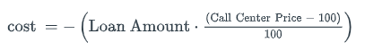

# PY4E-Module10A-CodeVU1
## Assignment
Often, Loan Officers need a chart of data about rates and costs when discussing various options with a borrower. 

Write a program to display a chart of possible rates and their associated costs for a given product name and lock period.

This program should take as input the Product Name, the Lock Period (in days), and the Loan Amount. Then the program should read the current pricing sheet csv. The output should be a chart of the calculated data appropriate to the user's input. This chart should contain: Product Name, Lock Period, Cost, and Rate.

The Sample Files section includes a sample Pricing Sheet. Every morning, Capital Markets will generate a new pricing sheet, so it is constantly changing, but use this file to develop your program.

## Formulas


Cost is the price the borrower has to add to or deduct from the loan in order to change the rate. Typically, the lower the rate, the more it will cost the borrower. Inversely, the higher the rate, the more the borrower can deduct from the loan. 

A cost of $0 is called "par". If there is no cost of $0, then par is the closest amount to $0.

## Desired Output

```
Enter Product Name: 10003.20.001
Enter Lock Period : 45
Loan Amount       : 250000
|--------------|--------|----------------|--------|
|              |  Lock  |                |        |
| Product Name | Period |      Cost      |  Rate  |
|--------------|--------|----------------|--------|
| 10003.20.001 |     45 |      $5,955.00 | 4.250% |
| 10003.20.001 |     45 |      $4,355.00 | 4.375% |
| 10003.20.001 |     45 |      $2,512.50 | 4.500% |
| 10003.20.001 |     45 |      $1,865.00 | 4.625% |
| 10003.20.001 |     45 |      $1,557.50 | 4.750% |
| 10003.20.001 |     45 |          $0.00 | 4.875% |
| 10003.20.001 |     45 |       $-607.50 | 4.990% |
| 10003.20.001 |     45 |     $-1,270.00 | 5.125% |
| 10003.20.001 |     45 |     $-1,582.50 | 5.250% |
| 10003.20.001 |     45 |     $-1,875.00 | 5.375% |
| 10003.20.001 |     45 |     $-2,202.50 | 5.500% |
| 10003.20.001 |     45 |     $-2,480.00 | 5.625% |
| 10003.20.001 |     45 |     $-2,795.00 | 5.750% |
| 10003.20.001 |     45 |     $-4,380.00 | 5.875% |
| 10003.20.001 |     45 |     $-5,025.00 | 5.990% |
```

## What is a CSV? 
CSV stands for comma-separated values. 

The first line in the file is the headers. These strings tell you what to expect in each column.

After the first line, each line is one row of data. You can separate the pieces of data using ",". 

If you want to just view the data, you can also open a CSV in Excel!

## Assumptions
You can assume that the file will be ordered by Product Name, then by Lock Period, then by Rate. This is the same order expected in the chart, so you do not need to sort anything.

## Help and Advice
Don't try to do the whole program at once; take it in small chunks.
Don't get wrapped up in the formatting (how it looks) right away. Get the raw data to be correct first.
Don't worry about exception handling right away. Assume the user will always input good data at first, until the program is working. Then handle user errors and other exceptions.
Be sure to look at the sample file provided. Capital Markets uses a specific string to mean that there is no data at a certain point.
Do not edit the Sample File. It may be tempting to do a find/replace on the sample file to make the application easier to write, but remember that this file comes from Capital Markets and changes constantly. You don't have full control of this file.
This assignment will require knowledge of every previous module! You need to know how to read a file, convert it to a list and iterate through the list, and how to extract and format strings.
Disclaimer
This is an over-simplification of calculating cost on a loan. There are many, many other factors involved (branches, LLPAs, Credit Score adjustments, etc). Please do not use this program when discussing real loans with real borrowers. Lock+ is designed for this.


## Hint:
If your test isn't passing, you can try `pytest -v`. 
This will run pytest, but you will get more information like the names of the tests and what's being compared.

If you get stuck trying to figure out the spacing for the numbers, [check out the `format()` method](https://www.w3schools.com/python/ref_string_format.asp).

## Test
Once your code is finished, run `pytest` to see if the formatting matches!
